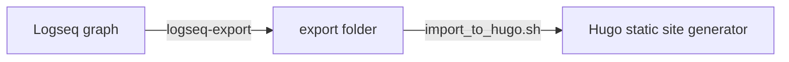

# logseq-export

Tool to export raw [Logseq](https://github.com/logseq/logseq) Markdown pages (with `public::` page property) into Markdown blog posts with front matter.

- Takes Logseq page properties (`title:: Hello world`) and turns them into [Front Matter properties](https://gohugo.io/content-management/front-matter/) `title: Hello World`.
- Changes the Markdown syntax to remove the top-level bullet points.

**Note: I completely reworked `logseq-export` to be a bit more versatile and universal. See the [version `v0.0.3`](https://github.com/viktomas/logseq-export/tree/v0.0.3) if you are not ready to move on.**

## Install

- Download the latest binary for your OS in the [Releases](https://github.com/viktomas/logseq-export/releases) page
- `go install github.com/viktomas/logseq-export@latest` if you have Go installed

## Usage

The `logseq-export` utility will export the pages into an export folder that can then be imported into your static site generator.



### Export

```
logseq-export
  -outputFolder string
        [MANDATORY] Folder where all public pages are exported.
  -logseqFolder string
        [MANDATORY] Path to the root of your logseq graph containing /pages and /journals directories.
```

*Optional* configuration is in a file called `export.yaml` in your logseq folder.

```yml
# list of logseq page properties that won't be quoted in the markdown front matter
unquotedProperties:
  - date
  - tags
```

#### Command example

This is how I run the command on my machine:

```sh
logseq-export \
  --logseqFolder /Users/tomas/workspace/private/notes \
  --outputFolder /tmp/logseq-export \
```

This will take my logseq notes and copies them to the export folder, it will also copy all the images to `/tmp/logseq-export/logseq-assets`, but the image links themselves are going to have `/logseq-asstes/` prefix (``).

#### Constraints

- `logseq-export` assumes that all the pages you want to export are in `pages/` folder inside your `logseqFolder`.


### Import

```sh
# these environment variables are optional
# the values in this example are default values
export BLOG_CONTENT_FODLER="/graph"
export BLOG_IMAGES_FOLDER="/assets/graph"

# copies pages from `/tmp/logseq/export/logseq-pages` to `~/workspace/private/blog/content/graph`
# copies assets from `/tmp/logseq/export/logseq-assets` to `~/workspace/private/blog/static/assets/graph`
# replaces all `/logseq-assets` in all image URLs with `/assets/graph`
./import_to_hugo.sh \
  /tmp/logseq-export
  ~/workspace/private/blog
```

### Logseq page properties with a special meaning (all optional)

- `public` - as soon as this page property is present (regardless of value), the page gets exported
- `title` - either the `title::` is present and used as `title:` front matter attribute, or the page file name is unescaped (e.g. `%3A` changes to `:`) and used as the `title:`
- `slug` used as a file name
- `date` it's used as a file name prefix
  - if your logseq `date::` attributes contains the link brackets e.g. `[[2023-07-30]]`, `logseq-export` will remove them

## From


## To

`content/graph/2022-09-25-test-page.md` :

~~~md
---
date: "2022-09-25"
public: true
slug: "test-page"
title: "Test page"
---

This is an example paragraph

- Second level means bullet points
	- `logseq-export` also supports multi-level bullet points

```ts
const v = "Hello world"
```

You can
also
have

Multi-line strings
~~~
